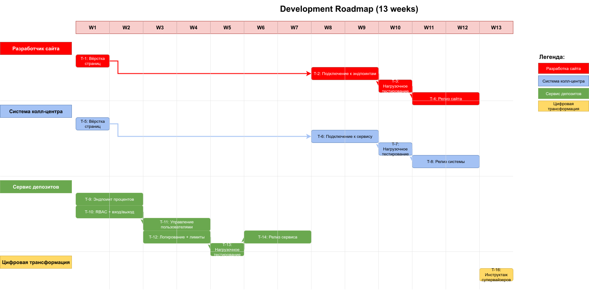

# Задание 4: дополнительные требования к MVP

# ADR
[ADR по задаче -- по ссылке](./task4_adr.md)

# Роадмап
Раз речь зашла об оценке ресурсов проекта, возьму на себя смелость сделать роадмап чуть детальнее.

[Роадмап в Excel](./roadmap.xlsx)

## Резюме

* плюс 6 человеко-месяцев (и, соответственно, денег),
* займёт 3.5 месяцев, т.е. в сроки запуска MVP уложиться можно,
* начинать нужно с доработок сервиса депозитов,		
* доработки сервиса депозитов по поиску нужно запускать **сразу, независимо от разработки остального функционала**		
* нужен +1 человек в команду разработки сервиса депозитов, причём сразу.